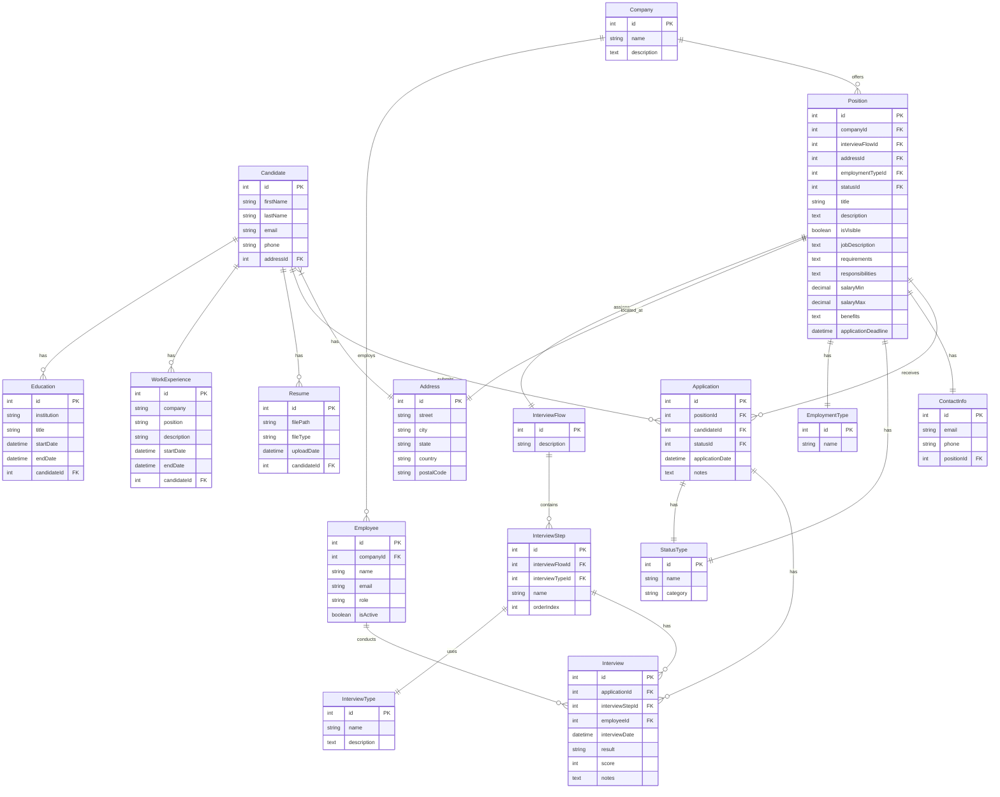

# Esquema de Base de Datos

Este documento describe el esquema de la base de datos del sistema de seguimiento de talento.

## Diagrama ER

## Descripción de Entidades

### Entidades de Normalización

1. **StatusType**
   - Almacena los diferentes estados para posiciones y aplicaciones
   - Categoría indica si el estado es para posición o aplicación

2. **Address**
   - Almacena direcciones normalizadas
   - Usado tanto por Candidate como por Position

3. **EmploymentType**
   - Tipos de empleo disponibles
   - Relacionado con Position

4. **ContactInfo**
   - Información de contacto para posiciones
   - Relación uno a uno con Position

### Entidades Principales

1. **Company**
   - Información de la empresa
   - Relacionada con Employee y Position

2. **Candidate**
   - Información del candidato
   - Relacionada con Education, WorkExperience, Resume y Application

3. **Position**
   - Información de la posición
   - Relacionada con Company, InterviewFlow, Address, EmploymentType y StatusType

4. **Application**
   - Aplicaciones de candidatos a posiciones
   - Relacionada con Position, Candidate y StatusType

5. **Interview**
   - Entrevistas realizadas
   - Relacionada con Application, InterviewStep y Employee

## Índices

### Índices de Búsqueda Frecuente

- Candidate: email, addressId
- Position: companyId+statusId, addressId, employmentTypeId, applicationDeadline, isVisible
- Application: positionId, candidateId, statusId, applicationDate
- Interview: applicationId, interviewStepId, employeeId, interviewDate

### Índices de Ordenamiento

- InterviewStep: orderIndex

### Índices de Relaciones

- Todas las claves foráneas tienen sus índices correspondientes
